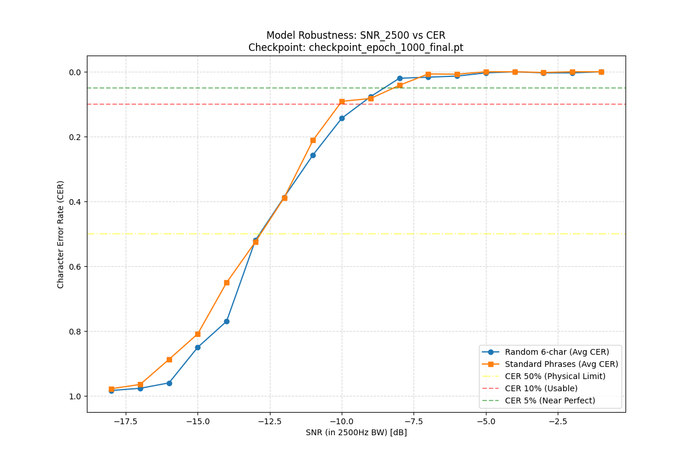
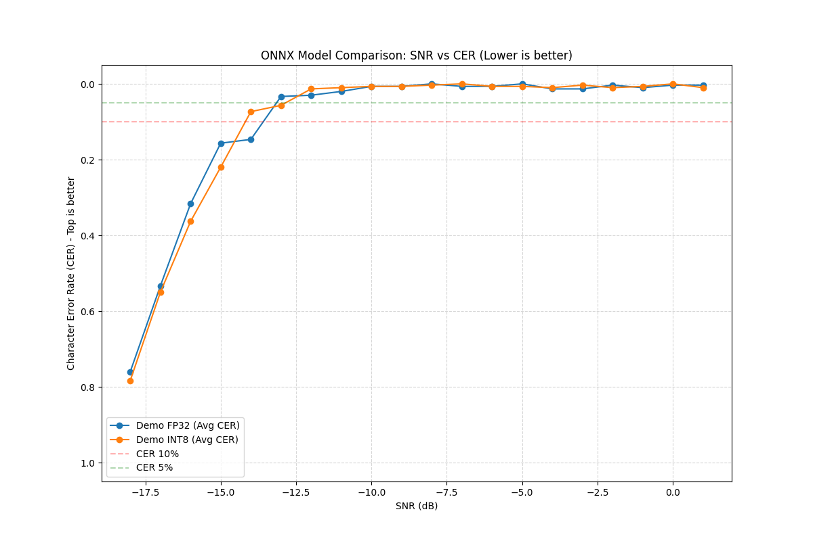
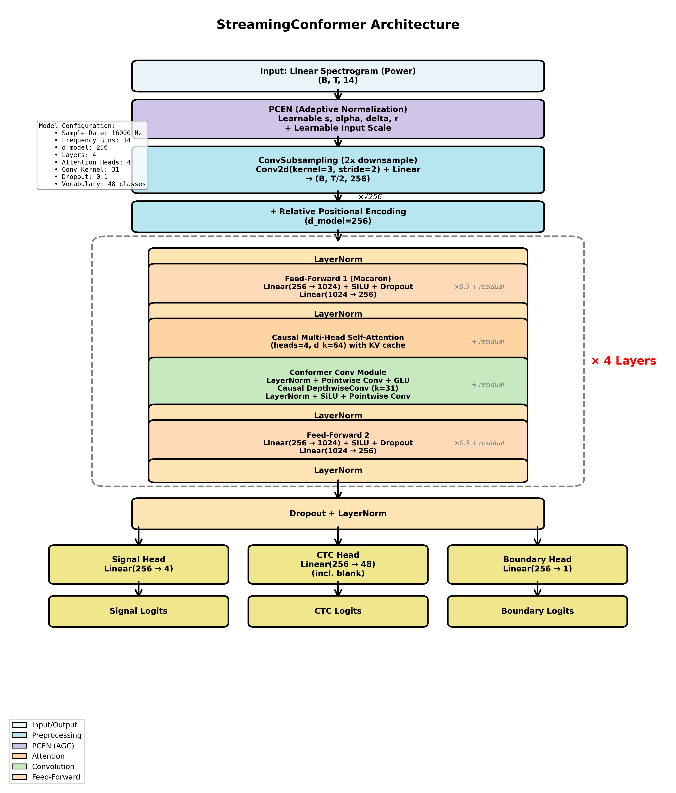

# CW Decoder (Streaming Conformer)

ディープラーニング（Streaming Conformer）を用いた、リアルタイム・モールス信号（CW）復号システムです。


*図1: 最新チェックポイントの SNR vs CER 性能曲線。*


*図2: ONNX エクスポートおよび INT8 量子化後の性能比較。*
WSL (Ubuntu) 上での学習および推論、最終的には Web ブラウザ上での動作を目指しています。

## 特徴
- **Streaming Conformer:** CTC 損失を用いたストリーミング対応の CNN + Transformer アーキテクチャ。
- **周波数クロッピング:** 広帯域信号からターゲット信号を DSP で特定し、軽量モデルで効率的に復号。
- **堅牢な合成データ:** 人間による打鍵の揺らぎや、HF 帯特有のノイズ・フェージングをシミュレートしたデータで学習。


*図3: モデルアーキテクチャ（Streaming Conformer）*

### 入出力形式
- **入力**: ターゲット信号の周波数付近をクロップしたスペクトログラム（14 bins）。
  - 事前の DSP 処理により信号のピーク周波数を特定し、その周辺のみを抽出してモデルに入力します。これにより、広帯域な信号処理をモデルから切り離し、推論の軽量化を実現しています。
- **出力**:
  - **CTC Logits**: 文字列復号用。
  - **Signal Logits**: 物理的な信号状態（Dit/Dah/Space/WordSpace）のフレーム単位分類。
  - **Boundary Logits**: 文字境界の予測。

## 環境構築 (WSL2 / Docker)

NVIDIA Container Toolkit がインストールされた WSL2 環境を前提としています。

### 1. Docker イメージのビルド
```bash
docker build -t cw-decoder .
```

### 2. コンテナの起動（GPU 有効化・ディレクトリマウント）
```bash
docker run --rm -it --gpus all -v `pwd`:/workspace cw-decoder bash
```

### 3. GPU 認識の確認 (コンテナ内)
```python
python -c "import torch; print(f'CUDA available: {torch.cuda.is_available()}')"
```

### 4. 学習の実行 (コンテナ内)
```bash
python3 train.py --samples-per-epoch 1000 --epochs 10 --batch-size 16
```
ホスト側から直接実行する場合:
```bash
docker run --rm --gpus all -v `pwd`:/workspace cw-decoder python3 train.py --samples-per-epoch 1000 --epochs 3 --batch-size 8
```

## プロジェクト構造

### モデル開発 (Python/PyTorch)
- `model.py`: Lightweight Streaming Conformer モデルの定義。
- `data_gen.py`: 高度な人間的揺らぎとノイズをシミュレートするデータジェネレータ。
- `train.py`: 学習スクリプト。
- `export_onnx.py` / `quantize_onnx.py`: ONNX エクスポートおよび量子化スクリプト。
- `diagnostics/visualize_snr_performance.py`: モデルのノイズ耐性評価スクリプト。
- `diagnostics/visualize_snr_performance_pt_streaming.py`: ストリーミング推論（PyTorch）のノイズ耐性評価スクリプト。

### 推論・デモ (JavaScript/ONNX Runtime)
- `demo/inference.js`: Node.js/ブラウザ共用の推論コアロジック。
- `demo/dsp.js` / `demo/data_gen.js`: JS 版の信号処理・データ生成モジュール。
- `demo/evaluate_snr.js`: Node.js 上での精度評価スクリプト。
- `demo/demo.js`: ブラウザデモ用フロントエンド。
- `demo/audio-processor.js`: Web Audio API 用の信号処理ワークレット。

## SNR の定義
本プロジェクトにおける SNR (Signal-to-Noise Ratio) は、以下の基準で定義されています。

- **信号電力 ($P_{\text{signal}}$):** モールス信号が **ON（マーク）の状態** における正弦波の平均電力。
  - 振幅 $A$ の正弦波の場合、$P_{\text{signal}} = A^2 / 2$ です。
- **雑音電力 ($P_{\text{noise}}$):** 全帯域（ナイキスト周波数まで）における加法性ホワイトガウスノイズ (AWGN) の平均電力。
- **SNR 計算式:** $\text{SNR}_{\text{dB}} = 10 \log_{10} (P_{\text{signal}} / P_{\text{noise}})$

この定義により、送信する文章のデューティ比（ON/OFF比率）に依存せず、信号が存在する瞬間の強度に基づいてノイズ耐性を評価しています。

## 開発フェーズ
1. **フェーズ 1:** データジェネレータの実装
2. **フェーズ 2:** モデル定義と学習（オンザフライ生成）
3. **フェーズ 3:** リアルタイム推論エンジン（Python）の開発
4. **フェーズ 4:** Web ブラウザ（ONNX Runtime Web / WASM）へのデプロイ

## 技術的設計と知見

### 1. マルチタスク学習と強制的な構造学習
学習初期、CTC はアライメントが一切得られない「宝探し」のような状態に陥ります。この問題を打破し、モデルに信号の物理的構造を強制的に学習させるため、複数の補助ヘッドを併用しています。
- **Signal Head**: フレーム単位の信号状態（Dit/Dah/Space）を分類。低レイヤーに「何が信号で何がノイズか」を教え込み、特徴抽出を安定化させます。
- **Boundary Head**: 文字境界（文字間空白の終端）を予測。アライメントの拠り所を与え、低 SNR 時のスパイク崩壊を防ぎます。

### 2. なぜ合成データ環境で CTC を使うのか
本プロジェクトは合成データを使用しているため、原理的には全フレームに対して厳密なラベル付け（強教師あり学習）が可能です。しかし、あえて CTC をメインの損失関数に採用しています。

これは、**出力を簡略化し、デコード処理を軽量化するため**です。フレーム単位の厳密な分類結果から文字列を再構成するよりも、CTC によるスパイク出力を扱う方が、ストリーミング推論における後処理（デバウンスや重複除去）が圧倒的にシンプルになり、ブラウザ上でのリアルタイム動作に適しています。

### 3. 設計のポイント: バウンダリ情報の分離
Boundary Head の出力を CTC Head の入力に直接混ぜる構成は採用していません。これは、モデルが音声特徴の学習をサボり、境界信号をトリガーに「その場で最もらしい文字を出す」というショートカット（カンニング）を学習してしまうのを防ぐためです。代わりに、学習時のみ境界外の出力を罰する **Illegal Spike Penalty** を導入し、推論時の因果性を保ちつつスパイク位置をピンポイントに矯正しています。

### 4. 徹底したカリキュラムトレーニング
リズムの微細な差や包含関係にある符号（E と T、S と H など）を正確に捉えるため、段階的な学習プロセスを構築しています。
- **包含構造優先の段階的導入（数字からの開始）**: 単純なアルファベット順や出現頻度順ではなく、まず数字（長い符号）から開始し、その構成要素となるプレフィックス文字（例：`1` に対する `A, J, W, E`）をセットで導入します。これにより、長い符号の途中で短い符号として誤判定（Partial Decoding）してしまう問題を初期段階から抑制します。
- **新文字への集中学習（Focus学習）**: 新しい文字セットが導入された際、その新文字が高い確率で出現するようにサンプリングを調整し、既存の習得済み文字との境界（リズムの差）を集中して学習させます。
- **段階的環境悪化**: クリーンな環境でリズムを習得した後、打鍵の揺らぎ、ノイズ、フェージング（QSB）、周波数ドリフトなどを順次導入し、実用的な堅牢性を獲得させます。

### 5. ストリーミング推論における物理的制約（先読みと WPM）
本モデルはリアルタイム性を確保するため、`LOOKAHEAD_FRAMES = 30`（300ms）という限定的な未来参照を行っています。この固定的な先読み時間は、デコード可能な信号の最小速度（WPM）に対して物理的な制約を与えます。

- **40 WPM (高速)**: 1 ユニット（短点）は約 30ms。300ms の先読みは 10 ユニット分に相当し、1 文字のほぼ全体を「未来」として参照できるため、判定は非常に安定します。
- **10 WPM (低速)**: 1 ユニットは約 120ms。300ms の先読みはわずか 2.5 ユニット分です。モールス符号のダッシュ（3 ユニット = 360ms）の終了すら先読み範囲に収まらないため、モデルは信号の長さを確定できず、誤認や過剰な分割が発生しやすくなります。

この物理的整合性を保つため、現在の 300ms 設定では **15 WPM**（1 ダッシュ = 240ms）を実用的な下限速度としてカリキュラムを設計しています。

## 開発ワークフロー

本プロジェクトでは、モデルの学習からブラウザデプロイまで、以下のサイクルで開発を進めます。

### 1. モデルの学習と改善 (PyTorch)
`train.py` を用いてモデルを学習させ、ロスや CER の推移を確認します。
```bash
make train ARGS="--epochs 10"
docker run --rm --gpus all -v `pwd`:/workspace cw-decoder python3 -u train.py --epochs 1000 --batch-size 32 --samples-per-epoch 2000 --resume latest
```

### 2. モデルの性能限界の評価
学習したチェックポイントに対して、SNR ごとの CER 曲線を描画し、モデルのノイズ耐性を確認します。
```bash
make performance
# 成果物: diagnostics/visualize_snr_performance.png
```

### 3. ONNX エクスポートと量子化
モデルを ONNX 形式に変換し、ブラウザ向けに軽量化（INT8 量子化）します。
```bash
make onnx
# 成果物: demo/cw_decoder.onnx, demo/cw_decoder_quantized.onnx
```

### 4. ONNX モデルの精度検証 (Python)
量子化による精度劣化がないかを Python 環境で確認します。
```bash
make performance_onnx
# 成果物: diagnostics/visualize_snr_performance_onnx.png
```

### 5. JavaScript 推論エンジンの検証 (Node.js)
ブラウザ向けに移植した JS ロジック（DSP、デコード）が Python 実装と数値的に整合しているかを検証します。

*   **ユニットテスト:** ロジックの単体テスト
    ```bash
    make test-js
    ```
*   **精度評価:** JS 推論エンジンによる SNR 評価。高 SNR で CER 0% になることを確認し、移植ミスを検出します。
    ```bash
    make evaluate-js
    ```

### 6. ブラウザでの動作確認
最後に `demo/demo.html` をブラウザで開き、実際のリアルタイム復号動作を確認します。